# Microsoft Foundry and Cosmos DB implementation plan

## Purpose

This plan adds only the Azure resources needed by the gallery automation that
already runs in GitHub Actions. The gallery remains a static Docusaurus site on
GitHub Pages. Microsoft Foundry reviews collected candidates and powers the
chatbot. Cosmos DB owns the canonical gallery catalog, review queue, and pipeline
audit records. Azure provides workload identity, a bounded chatbot API, and
telemetry.

No existing Foundry or Cosmos DB resource should be reused. The gallery receives
a dedicated resource group, workload identities, Foundry model deployment,
serverless Cosmos DB account, telemetry boundary, budget, and rollback path.
There is no separate Azure OpenAI account. GitHub Pages loads gallery records
through the managed API; `static/templates.json` remains migration input and an
offline development fixture only.

## Current readiness

- Target subscription: `CosmosDB-Demos-GeneralUse`.
- Required resource providers are registered or checked before deployment:
   `Microsoft.CognitiveServices`, `Microsoft.DocumentDB`,
   `Microsoft.ManagedIdentity`, `Microsoft.OperationalInsights`, and
   `Microsoft.Insights`.
- The provisioning operator currently has subscription-level Owner and
  Contributor access.
- Central US passed the complete-stack availability check and now hosts
   `MAI-Thinking-1` version `2026-06-01` with Global Standard capacity `10`.
   It is a public-preview,
   chat-completions-only model, so activation remains conditional on the existing
   fail-closed benchmark.
- The repository already exchanges GitHub OIDC tokens for short-lived Azure
  tokens and does not require an Azure client secret.
- AI evaluation, candidate analysis, catalog mutation, and publication remain
  disabled until their gates pass.

Model availability and quota are volatile. Recheck both immediately before
deployment. Do not substitute a model, region, or existing account merely to
bypass a failed preflight.

## Architecture

```mermaid
flowchart LR
   SOURCES[Trusted endpoints] --> DISCOVERY[Discovery workflow]
   DISCOVERY --> CANDIDATES[(review-candidates)]
   REVIEWER[Foundry review workflow] --> CANDIDATES
   REVIEWER --> DECISIONS[(review-decisions)]
   REVIEWER --> FOUNDRY[Microsoft Foundry]
   FOUNDRY --> MODEL[MAI-Thinking-1]
   PUBLISHER[Authorized publisher] --> CATALOG[(catalog-items)]
   PUBLISHER --> PUBLIC[(public-catalog)]
   DISCOVERY --> AUDIT[(pipeline-records)]
   REVIEWER --> AUDIT
   PUBLISHER --> AUDIT
   PUBLIC --> API[Managed gallery API]
   API --> PAGES[GitHub Pages]
   PAGES --> CHATAPI[Managed chatbot API]
   CHATAPI --> PUBLIC
   CHATAPI --> FOUNDRY
   CATALOG --> LAW[Log Analytics]
   FOUNDRY --> LAW
```



## Decisions

| Area | Decision |
| --- | --- |
| Hosting | Keep the public gallery on GitHub Pages. |
| Azure isolation | Create a dedicated resource group, Foundry resource, and Cosmos DB account. |
| Region | Central US, selected from the current common availability set for Foundry, Functions, Cosmos DB, Storage, and API Management. |
| Foundry resource | Use `kind: AIServices`. `Microsoft.CognitiveServices/accounts` is its ARM provider type, not a separate Azure OpenAI service in this design. |
| Initial model | Deploy `MAI-Thinking-1` version `2026-06-01`, ARM SKU `GlobalStandard`, capacity `10`, as the evaluation candidate. |
| Model fallback | Use `gpt-4o-mini` version `2024-07-18`, ARM SKU `GlobalStandard`, capacity `10` only after a reviewed MAI benchmark failure. |
| API mode | Add `mai-chat` for `/mai/v1/chat/completions`. MAI does not document JSON-schema structured output, so strict local schema validation remains mandatory and any malformed output fails closed. |
| Canonical store | Use Cosmos DB for NoSQL serverless with pre-created `catalog-items`, `public-catalog`, `review-candidates`, `review-decisions`, and `pipeline-records` containers; no provisioned throughput. |
| Catalog model | Published gallery items live in `catalog-items`, partitioned by `/catalogPartition` with value `gallery`; records use a `type` discriminator and omit TTL. |
| Review model | Candidates live in `review-candidates`; append-only Foundry decisions live in `review-decisions`; both partition by `/runKey` and omit TTL. |
| Public projection | `public-catalog` stores versioned approved projections plus an active-snapshot marker; the API identity cannot read canonical or review containers. |
| Audit model | Compact workflow provenance, hashes, and receipts live in `pipeline-records`, partitioned by `/runKey`, without TTL. GitHub artifacts are corroborating raw evidence under GitHub retention. |
| Data authority | Cosmos DB is authoritative. GitHub Pages queries it through the managed API; static JSON is migration input and an offline fixture only. |
| Authentication | GitHub OIDC and Azure managed identities only; no client secrets, account keys, or connection strings. |
| Authorization | Collection, review decisions, publication, and API access use separate containers and roles. Only publication can create or replace canonical/public catalog items. |
| Network posture | Public model endpoint with Entra authentication and local/key authentication disabled. Add private networking only if runners move into Azure. |
| Foundry data access | Reviewer and chatbot code query Cosmos with their own identities and pass bounded records to Foundry. The model receives no Cosmos credentials. |
| Public predicate | Publisher projects only `type = catalog-item`, `publicationStatus = published`, and `lifecycleStatus IN (active, needs-review)`; Pages/chatbot read one committed projection version. |
| Audit | Keep immutable GitHub artifact receipts and send Foundry and Cosmos DB resource logs and metrics to Log Analytics. |
| Mutation | Keep all mutation and publisher flags disabled during Azure activation. |

The initial deployment is pay-as-you-go. Provisioned throughput is unnecessary
for scheduled evaluation and candidate analysis.

## Naming

Resolve `<suffix>` once using a short, stable, globally unique value.

| Resource | Proposed name |
| --- | --- |
| Resource group | `rg-cosmos-gallery-dev` |
| Microsoft Foundry resource | `aif-gallery-dev-<suffix>` |
| Model deployment | `gallery-mai-thinking-1` |
| Cosmos DB account | `cosmos-gallery-dev-<suffix>` |
| Cosmos DB database | `gallery` |
| Catalog container | `catalog-items` |
| Public projection | `public-catalog` |
| Candidate container | `review-candidates` |
| Decision container | `review-decisions` |
| Audit container | `pipeline-records` |
| Evaluation identity | `id-gallery-model-eval-dev` |
| Candidate identity | `id-gallery-candidate-analysis-dev` |
| Storage identity | `id-gallery-pipeline-writer-dev` |
| Publication identity | `id-gallery-catalog-publisher-dev` |
| Chatbot identity | `id-gallery-chat-dev` |
| Log Analytics workspace | `log-gallery-platform-dev-eus2` |
| Action group | `ag-gallery-platform-dev` |

Use tags on every resource:

```text
application=gallery
environment=dev
owner=jaydestro
repository=https://github.com/jaydestro/gallery
managed-by=bicep
```

## Phase 1: Foundry and Cosmos DB foundation

### 1. Preflight

1. Confirm the active subscription and tenant.
2. Confirm Central US model availability and quota for `MAI-Thinking-1`, version
   `2026-06-01`, and Global Standard SKU.
3. Confirm Cosmos DB serverless account support and account capacity.
4. Confirm the locked MAI deployment capacity is `10`; do not auto-substitute a
   model, SKU, capacity, or region.
5. Record current retail pricing and set a monthly budget before enabling calls.
6. Verify that all GitHub write/review environments remain restricted to the protected
   default branch.

Stop if any exact model/SKU check fails. A fallback is a new reviewed decision,
not an automatic deployment substitution.

### 2. Infrastructure as code

Create Bicep in a follow-up implementation change. It should deploy:

1. The dedicated resource group.
2. One Microsoft Foundry resource (`kind: AIServices`) with local authentication
   disabled; do not create a separate Azure OpenAI account.
3. One Global Standard model deployment.
4. One serverless Cosmos DB for NoSQL account with local authentication disabled.
5. Database `gallery` and containers `catalog-items`, `public-catalog`,
   `review-candidates`, `review-decisions`, and `pipeline-records`, created
   without throughput settings.
6. Workload identities for model evaluation, candidate review, collection/audit,
   catalog publication, and managed API access.
7. Exact federated identity credentials for GitHub-hosted workloads.
8. Account-scoped inference roles plus custom container-scoped Cosmos DB roles:
   collection creates candidates/audits; review reads catalog/candidates and
   creates decisions; publication alone mutates catalog; the API reads the
   committed public projection only.
9. A Log Analytics workspace and diagnostic settings for Foundry and Cosmos DB.
10. An action group and resource-group-scoped monthly budget alerts.

The Bicep deployment identity needs resource creation and role-assignment
permissions. Runtime identities do not receive Contributor, Reader, User Access
Administrator, or subscription-scoped roles.

### 3. GitHub OIDC federation

Use issuer `https://token.actions.githubusercontent.com` and audience
`api://AzureADTokenExchange`.

| Identity | Federated subject |
| --- | --- |
| Evaluation | `repo:jaydestro@2974195/gallery@1348841742:environment:gallery-model-evaluation` |
| Candidate analysis | `repo:jaydestro@2974195/gallery@1348841742:environment:gallery-candidate-analysis` |
| Pipeline storage | `repo:jaydestro@2974195/gallery@1348841742:environment:gallery-pipeline-storage` |
| Catalog publication | `repo:jaydestro@2974195/gallery@1348841742:environment:gallery-publication` |

Environment subjects intentionally bind trust to GitHub environments rather
than a branch subject. GitHub environment deployment policies provide the branch
restriction, and the workflows separately verify default-branch repository,
ref, SHA, run, and artifact provenance.

### 4. GitHub environment configuration

Set the existing model variables in `gallery-model-evaluation` and
`gallery-candidate-analysis`. Their legacy `AZURE_OPENAI_*` names are retained as
an application compatibility contract, but the endpoint and deployment belong
to the Microsoft Foundry resource:

| Variable | Value |
| --- | --- |
| `AZURE_CLIENT_ID` | Client ID of that environment's managed identity |
| `AZURE_TENANT_ID` | Deployment tenant ID |
| `AZURE_SUBSCRIPTION_ID` | Target subscription ID |
| `AZURE_OPENAI_ENDPOINT` | Root HTTPS `.services.ai.azure.com` endpoint of the Foundry resource |
| `AZURE_OPENAI_DEPLOYMENT` | `gallery-mai-thinking-1` |
| `AZURE_OPENAI_API_MODE` | `mai-chat` |

Set these non-secret variables in `gallery-pipeline-storage`:

| Variable | Value |
| --- | --- |
| `AZURE_CLIENT_ID` | Client ID of the pipeline storage identity |
| `AZURE_TENANT_ID` | Target tenant ID |
| `AZURE_SUBSCRIPTION_ID` | Target subscription ID |
| `AZURE_COSMOS_ENDPOINT` | Root HTTPS Cosmos DB account endpoint |
| `AZURE_COSMOS_DATABASE` | `gallery` |
| `AZURE_COSMOS_CANDIDATE_CONTAINER` | `review-candidates` |
| `AZURE_COSMOS_DECISION_CONTAINER` | `review-decisions` |
| `AZURE_COSMOS_AUDIT_CONTAINER` | `pipeline-records` |

Publication and API workloads use the same endpoint/database with their own
client IDs and only the container names their roles permit.

Do not add an API key, client secret, bearer token, connection string, or endpoint
path as a GitHub secret. Tokens remain ephemeral and are masked by the workflows.

### 5. Observability and cost controls

Configure these alerts before activation:

- Monthly budget notifications at 50%, 80%, and 100% of the approved amount.
- Model deployment throttling or quota saturation.
- Elevated server errors.
- Unexpected request volume outside scheduled workflow windows.
- No successful inference during an expected scheduled evaluation window.

Start with a USD 25 monthly development budget unless a different amount is
approved during deployment. This is a guardrail, not a cost forecast. Record the
then-current token prices and expected corpus token count in the deployment PR.
The retail pricing feed did not return a reliable model-specific estimate during
planning, so no static token price is embedded here.

Cosmos `pipeline-records` is the durable audit authority for compact provenance,
hashes, and receipts; GitHub artifacts are corroborating raw evidence subject to
repository retention. Catalog, review, and audit records do not expire
automatically. Use Azure Monitor for service health, request, latency,
throttling, RU consumption, and consumption signals; do not place credentials in
records or resource logs.

## Phase 2: Validation and staged activation

Run each gate independently and stop at the first failure.

1. Build, lint, security-scan, and contract-test the Bicep locally.
2. Do not run online validation, what-if, deployment, or GitHub environment
   configuration until the user gives a post-risk deployment acknowledgement.
3. Verify through contract tests that local/key authentication is disabled.
4. Verify through contract tests that review can read catalog/candidates and
   write decisions but cannot publish; publication alone can mutate catalog;
   API identity can read `public-catalog` only.
5. Run offline MAI adapter tests covering the exact endpoint, bearer auth,
   malformed output, fenced prose, multiple choices, tool calls, truncation,
   refusal, and schema mismatch.
6. Run workflow security tests proving model evaluation, candidate analysis, and
   Cosmos persistence remain disabled and cannot run from pull requests.
7. Validate persistence against fixtures for the exact producer paths
   `.github/workflows/discover-content.yml`,
   `.github/workflows/scan-gallery-health.yml`,
   `.github/workflows/evaluate-repository-freshness.yml`,
   `.github/workflows/evaluate-pipeline-policy.yml`,
   `.github/workflows/analyze-gallery-candidates.yml`, and
   `.github/workflows/propose-gallery-changes.yml`. Every producer must bind the
   repository, ref, SHA, run ID, run attempt, artifact digest, and member hashes.
8. Verify deterministic IDs, partition keys, ETag concurrency, source
   repository/ref/SHA/run/attempt, artifact/member hashes, TTL absence on all
   five containers, create-not-upsert behavior, and an item-size ceiling below 2 MB.
9. Verify `GET /gallery/items` is ordered, paginated, schema-valid, supports
   ETag/conditional GET, and never exposes Cosmos system or internal fields.
10. Seed all current records with create-only writes and prove source count,
   Cosmos count, API count, and canonical SHA-256 parity before cutover.
11. Verify publication binds decision, policy/model receipt, catalog snapshot,
   operation ID, and ETag; matching 409 is idempotent and 412 fails stale.
12. Verify APIM/Function authentication and enforce an 8 KiB body limit, 20
   requests/minute and 200/day per client IP, 30-second backend timeout, at most
   20 catalog context items, and at most 800 output tokens.
13. Run the complete existing CI suite and confirm live mutation remains disabled.

Keep these controls false throughout Azure activation:

```text
GALLERY_AUTOMATION_ENABLED=false
ENABLE_GALLERY_COSMOS_PERSISTENCE=false
ENABLE_GALLERY_COSMOS_CATALOG=false
automation.ai.*=false
automation.mutation.*=false
automation.emergencyDisable=true
```

Model review, Cosmos-backed catalog publication, persistence, and mutation are
separate future approvals. This implementation leaves all of them disabled.

## Chatbot access

GitHub Pages must never call Cosmos DB or Foundry directly. A small Azure API
uses a managed identity to read only the committed projection from
`public-catalog`. `GET /gallery/items` returns paginated gallery records;
`POST /gallery/chat` selects bounded context and sends it to Foundry.
The API returns the answer plus catalog item IDs and URLs used as evidence. It
stores no chat history by default.

Start with indexed metadata and tag filtering. Add Cosmos full-text or vector
search only after measured chatbot quality shows a need; do not add AI Search by
default.

## Rollback

Rollback is configuration-first:

1. Set model evaluation, candidate analysis, Cosmos persistence, and
   Cosmos-backed catalog variables to `false`.
2. Leave all mutation flags `false`.
3. Remove or disable the federated identity credentials if calls must stop
   immediately.
4. Disable the model deployment if cost or safety signals remain abnormal.
5. Revert the infrastructure deployment only after retaining receipts,
   diagnostic evidence, and the last known-good configuration.

The deterministic discovery, health, freshness, and proposal workflows continue
to operate without Azure inference. A model outage must reduce capability, not
weaken deterministic gates or trigger publication.

## Definition of done

- Dedicated resources are reproducibly deployed from reviewed Bicep.
- No long-lived Azure credential exists in GitHub.
- Each protected environment has its own identity and exact federated subject.
- Runtime model identities have inference-only access at Foundry account scope.
- Cosmos DB is the canonical catalog and review store; Pages queries it through the API.
- Collector, reviewer, publisher, and API roles are independently scoped.
- A trusted candidate is reviewed against current catalog data before publication.
- Catalog, review, and compact audit records do not expire automatically.
- The chatbot accesses public catalog items through a managed backend only.
- MAI adapter and prompt-injection fixtures pass offline; live activation remains disabled.
- Persistence fixtures cover all trusted producer workflows and reject unknown producers.
- Bicep validation and what-if show only planned creates in the dedicated resource group.
- Azure Monitor and budget definitions pass deployment validation.
- The full existing CI suite passes with zero catalog mutation.
- Chatbot API access is bounded, evidence-returning, and stores no conversation history by default.
