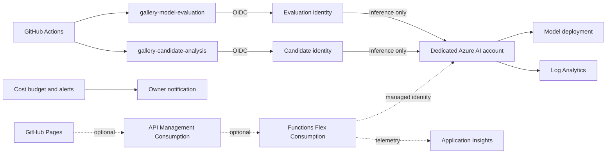

# Azure implementation plan

## Purpose

This plan adds only the Azure resources needed by the gallery automation that
already runs in GitHub Actions. The gallery remains a static Docusaurus site on
GitHub Pages. Azure provides model inference, workload identity, telemetry, and,
in a later optional phase, a chatbot API.

No existing Azure AI resource should be reused. The gallery receives a dedicated
resource group, identities, model deployment, telemetry boundary, budget, and
rollback path.

## Current readiness

- Target subscription: `CosmosDB-Demos-GeneralUse`.
- Required resource providers are registered: `Microsoft.CognitiveServices`,
  `Microsoft.Web`, and `Microsoft.Insights`.
- The provisioning operator currently has subscription-level Owner and
  Contributor access.
- East US 2 currently advertises `gpt-4.1-mini`, `gpt-4.1`, and `gpt-4o-mini`.
- The repository already exchanges GitHub OIDC tokens for short-lived Azure
  tokens and does not require an Azure client secret.
- AI evaluation, candidate analysis, catalog mutation, and publication remain
  disabled until their gates pass.

Model availability and quota are volatile. Recheck both immediately before
deployment. Do not substitute a model, region, or existing account merely to
bypass a failed preflight.

## Architecture



## Decisions

| Area | Decision |
| --- | --- |
| Hosting | Keep the public gallery on GitHub Pages. |
| Azure isolation | Create a dedicated resource group and AI account. |
| Region | Use East US 2; use Sweden Central only after a fresh capacity and data-residency review. |
| Initial model | Prefer `gpt-4.1-mini` version `2025-04-14`, Global Standard. |
| Capacity fallback | Use `gpt-4o-mini` version `2024-07-18`, Global Standard if the preferred deployment has no available quota or fails the benchmark. |
| API mode | Set `AZURE_OPENAI_API_MODE=responses`; retain `chat` only as a tested compatibility fallback. |
| Authentication | GitHub OIDC to two user-assigned managed identities; no client secrets or API keys. |
| Authorization | Assign `Cognitive Services OpenAI User` at the dedicated AI account scope only. |
| Network posture | Public model endpoint with Entra authentication and local/key authentication disabled. Add private networking only if runners move into Azure. |
| Audit | Keep immutable GitHub artifact receipts and send Azure resource logs and metrics to Log Analytics. |
| Mutation | Keep all mutation and publisher flags disabled during Azure activation. |

The initial deployment is pay-as-you-go. Provisioned throughput is unnecessary
for scheduled evaluation and candidate analysis.

## Naming

Resolve `<suffix>` once using a short, stable, globally unique value.

| Resource | Proposed name |
| --- | --- |
| Resource group | `rg-gallery-ai-dev-eus2` |
| Azure AI account | `aoai-gallery-dev-<suffix>` |
| Model deployment | `gallery-gpt-4-1-mini` |
| Evaluation identity | `id-gallery-model-eval-dev` |
| Candidate identity | `id-gallery-candidate-analysis-dev` |
| Log Analytics workspace | `log-gallery-ai-dev-eus2` |
| Action group | `ag-gallery-ai-dev` |
| Optional Function App | `func-gallery-chat-dev-<suffix>` |
| Optional managed identity | `id-gallery-chat-dev` |
| Optional API Management | `apim-gallery-chat-dev-<suffix>` |

Use tags on every resource:

```text
application=gallery
environment=dev
owner=jaydestro
repository=https://github.com/jaydestro/gallery
managed-by=bicep
```

## Phase 1: AI pipeline foundation

### 1. Preflight

1. Confirm the active subscription and tenant.
2. Confirm East US 2 model availability and quota for the exact model, version,
   and Global Standard SKU.
3. Select a conservative starting capacity based on the current quota and
   evaluation corpus size. Do not consume shared quota needed by another app.
4. Record current retail pricing and set a monthly budget before enabling calls.
5. Verify that both GitHub environments remain restricted to the protected
   default branch.

Stop if any exact model/SKU check fails. A fallback is a new reviewed decision,
not an automatic deployment substitution.

### 2. Infrastructure as code

Create Bicep in a follow-up implementation change. It should deploy:

1. The dedicated resource group.
2. One Azure AI Services or Azure OpenAI account with local authentication
   disabled.
3. One Global Standard model deployment.
4. Two user-assigned managed identities.
5. One federated identity credential on each identity.
6. Account-scoped `Cognitive Services OpenAI User` role assignments.
7. A Log Analytics workspace and diagnostic settings for the AI account.
8. An action group and resource-group-scoped monthly budget alerts.

The Bicep deployment identity needs resource creation and role-assignment
permissions. Runtime identities do not receive Contributor, Reader, User Access
Administrator, or subscription-scoped roles.

### 3. GitHub OIDC federation

Use issuer `https://token.actions.githubusercontent.com` and audience
`api://AzureADTokenExchange`.

| Identity | Federated subject |
| --- | --- |
| Evaluation | `repo:jaydestro/gallery:environment:gallery-model-evaluation` |
| Candidate analysis | `repo:jaydestro/gallery:environment:gallery-candidate-analysis` |

Environment subjects intentionally bind trust to GitHub environments rather
than a branch subject. GitHub environment deployment policies provide the branch
restriction, and the workflows separately verify default-branch repository,
ref, SHA, run, and artifact provenance.

### 4. GitHub environment configuration

Set these non-secret variables in both `gallery-model-evaluation` and
`gallery-candidate-analysis`:

| Variable | Value |
| --- | --- |
| `AZURE_CLIENT_ID` | Client ID of that environment's managed identity |
| `AZURE_TENANT_ID` | Deployment tenant ID |
| `AZURE_SUBSCRIPTION_ID` | Target subscription ID |
| `AZURE_OPENAI_ENDPOINT` | Root HTTPS endpoint of the dedicated AI account |
| `AZURE_OPENAI_DEPLOYMENT` | `gallery-gpt-4-1-mini` |
| `AZURE_OPENAI_API_MODE` | `responses` |

Do not add an API key, client secret, bearer token, connection string, or endpoint
path as a GitHub secret. Tokens remain ephemeral and are masked by the workflows.

### 5. Observability and cost controls

Configure these alerts before activation:

- Monthly budget notifications at 50%, 80%, and 100% of the approved amount.
- Model deployment throttling or quota saturation.
- Elevated server errors.
- Unexpected request volume outside scheduled workflow windows.
- No successful inference during an expected scheduled evaluation window.

Start with a USD 25 monthly development budget unless a different amount is
approved during deployment. This is a guardrail, not a cost forecast. Record the
then-current token prices and expected corpus token count in the deployment PR.
The retail pricing feed did not return a reliable model-specific estimate during
planning, so no static token price is embedded here.

Retain GitHub model receipts for decision auditability. Use Azure Monitor for
service health, request, latency, throttling, and consumption signals; do not log
candidate payloads or model prompts.

## Phase 2: Validation and staged activation

Run each gate independently and stop at the first failure.

1. Validate and preview the Bicep deployment.
2. Deploy the resource group, model, identities, role assignments, diagnostics,
   and budget.
3. Verify local/key authentication is disabled.
4. Verify each identity can invoke inference but cannot create deployments,
   change RBAC, or access the other GitHub environment.
5. Run `Evaluate gallery pipeline policy` manually on the protected default
   branch with `ENABLE_GALLERY_MODEL_EVALUATION=false` still set.
6. Review the model receipt against every configured threshold and prompt
   injection fixture.
7. Set `ENABLE_GALLERY_MODEL_EVALUATION=true` only after the benchmark passes.
8. Run a fresh discovery workflow, then manually run trusted candidate analysis
   against that exact run ID.
9. Verify the candidate artifact's repository, ref, SHA, run attempt, digest,
   schema, grounding excerpts, and complete-catalog duplicate analysis.
10. Set `ENABLE_GALLERY_CANDIDATE_ANALYSIS=true` only after the live-candidate
    run passes.
11. Run discovery, health, freshness, model analysis, and proposal end to end.
12. Confirm the proposal remains non-mutating and bounded before considering any
    publisher activation.

Keep these controls false throughout Azure activation:

```text
GALLERY_AUTOMATION_ENABLED=false
policy.aiAutomation.enabled=false
policy.mutation.enabled=false
policy.emergency.enabled=false
```

AI enablement and mutation enablement are separate approvals. Passing model
evaluation does not authorize catalog publication or retirement.

## Phase 3: Optional chatbot

Do not deploy chatbot resources as part of the pipeline foundation. Start this
phase only after the maintenance pipeline has stable usage and the chatbot has a
defined user experience and abuse policy.

Deploy:

1. Azure Functions Flex Consumption running Node.js.
2. A separate user-assigned managed identity with inference-only access to the
   dedicated AI account.
3. Application Insights linked to the Function App.
4. API Management Consumption in front of the function for CORS, quotas, rate
   limits, request-size limits, and response caching where safe.

The browser calls API Management, never the model endpoint. Allow only
`https://jaydestro.github.io` as a production origin. Enforce a small request
body, bounded output tokens, per-client throttling, and a hard upstream timeout.
Do not expose model credentials or Azure tokens to JavaScript.

Start without Azure AI Search, Cosmos DB, or conversation persistence. The
chatbot should answer from the published catalog payload supplied by the backend.
Add retrieval infrastructure only after measured catalog size or answer quality
shows it is necessary.

## Rollback

Rollback is configuration-first:

1. Set both AI enable variables to `false`.
2. Leave all mutation flags `false`.
3. Remove or disable the federated identity credentials if calls must stop
   immediately.
4. Disable the model deployment if cost or safety signals remain abnormal.
5. Revert the infrastructure deployment only after retaining receipts,
   diagnostic evidence, and the last known-good configuration.

The deterministic discovery, health, freshness, and proposal workflows continue
to operate without Azure inference. A model outage must reduce capability, not
weaken deterministic gates or trigger publication.

## Definition of done

- Dedicated resources are reproducibly deployed from reviewed Bicep.
- No long-lived Azure credential exists in GitHub.
- Each protected environment has its own identity and exact federated subject.
- Runtime identities have inference-only access at account scope.
- Model benchmark and prompt-injection fixtures pass on the deployed model.
- A live candidate run passes provenance, schema, duplicate, and grounding gates.
- Azure Monitor and budget alerts are tested.
- The full proposal chain completes with zero mutation.
- Rollback is exercised by disabling AI and confirming deterministic workflows
  still pass.
- Chatbot resources remain absent unless Phase 3 is separately approved.
