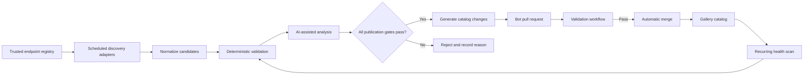
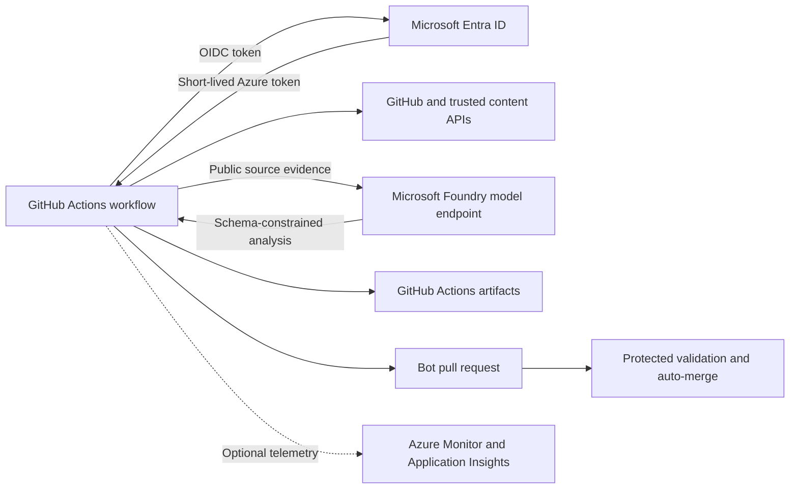
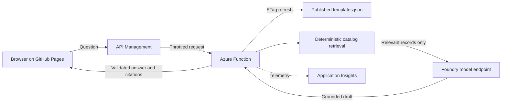

# Samples Gallery Content Discovery and Maintenance Proposal

**Status:** Draft for review
**Phase:** Proposal only; no implementation is included

## TL;DR

Create a fully autonomous GitHub Actions pipeline that discovers Azure Cosmos DB projects and learning resources from approved Azure GitHub organizations, Microsoft blogs, video channels, documentation sources, and curated community endpoints. It validates and deduplicates every candidate, uses independent AI-assisted checks to prove Cosmos DB relevance and write a factual summary, then publishes passing changes automatically. The same pipeline continuously checks existing entries and automatically updates, quarantines, or retires content that is broken, deleted, archived, superseded, or demonstrably stale. Humans govern source and quality policy, but are not part of the content publication path.

## Problem Statement

The gallery catalog is maintained as a single `static/templates.json` file. The site build confirms that the website compiles, but it does not verify that linked content still exists, remains maintained, or represents current product guidance. There is also no repeatable process for discovering high-value new material.

This creates four related problems:

1. **Missing content:** New samples, documentation, videos, tools, and reference applications are found ad hoc.
2. **Broken content:** Deleted pages, moved files, renamed repositories, and malformed URLs can remain published.
3. **Stale content:** An available URL can point to an archived or inactive repository, deprecated SDK, retired Azure service, or instructions that no longer work.
4. **Low-signal catalog growth:** Duplicate or weak entries can accumulate without improving topic, language, or scenario coverage.

Repository inactivity is an important signal, but it must not be an automatic deletion rule. Stable samples may require few commits, while an actively pushed repository may still contain obsolete guidance. Retirement decisions need combined freshness, validity, quality, relevance, and usage evidence.

## Preliminary Audit

An AI-assisted and deterministic baseline scan of the current catalog found:

| Signal | Result |
| --- | ---: |
| Gallery entries | 111 |
| Unique source URLs | 105 |
| Source URLs returning a definitive 404 | 7 |
| GitHub source entries | 56 |
| Unique GitHub repositories | 45 |
| Missing GitHub repositories | 2 |
| Archived GitHub repositories | 1 |
| Repositories with no push in the last year | 25 |
| Repositories with no push in the last two years | 7 |
| Entries dated more than two years ago | 58 |
| Entries using `coming soon` as the preview | 105 |
| Duplicate source groups | 6 |
| Tags used in data but absent from the declared taxonomy | 6 |

The broken set includes moved Microsoft Learn and Semantic Kernel pages, a removed LlamaIndex page, and two unavailable GitHub repositories. The archived repository is `Azure/Real-time-Payment-Transaction-Processing-at-Scale`. Under the proposed policy, repeated deterministic confirmation would automatically quarantine or retire these entries while preserving an audit record.

Coverage analysis also suggests discovery priorities. The gallery has 34 C# and 28 Python entries, compared with 12 Java, 8 TypeScript, 7 JavaScript, and 1 Go entry. MCP has 3 entries. Initial high-value searches should therefore emphasize current TypeScript/JavaScript, Java, and Go samples; agent and MCP scenarios; operational and security guidance; and maintained non-generative-AI application patterns.

## Goals

- Discover relevant new content from approved, trusted endpoints on a predictable cadence.
- Detect broken, deleted, archived, moved, duplicated, and stale content before users encounter it.
- Run discovery, analysis, validation, catalog updates, and retirement entirely in GitHub Actions.
- Add qualified content to the gallery automatically without creating duplicate entries.
- Generate accurate, evidence-grounded summaries and taxonomy metadata for each item.
- Evaluate repository freshness with explainable evidence rather than age alone.
- Use AI where semantic judgment adds value while keeping identity, link, schema, and repository checks deterministic.
- Publish auditable bot pull requests automatically when, and only when, every required gate passes.
- Reject uncertain candidates automatically rather than waiting for human content approval.
- Track coverage so new content fills useful gaps instead of merely increasing catalog size.

## Non-Goals

- Automatically deleting an entry solely because its repository has low commit activity.
- Crawling the unrestricted public web.
- Mirroring or taking ownership of third-party content.
- Replacing repository security, dependency, or build systems.

## Trusted Endpoint Registry

Discovery begins from a version-controlled allowlist. Each endpoint has an owner, content type, query method, trust tier, cadence, and optional topic filters.

### Initial Endpoint Classes

| Endpoint class | Initial trusted sources | Discovery method | Trust tier |
| --- | --- | --- | --- |
| GitHub organizations | `AzureCosmosDB`, approved paths in `Azure-Samples`, `Azure`, and `microsoft` | GitHub Search and repository APIs; organization events or webhooks where available | First party |
| GitHub topics | Curated combinations such as `azure-cosmos-db`, `cosmosdb`, `azure-cosmos-db-sample`, and approved scenario terms | GitHub Search API, constrained by the version-controlled owner allowlist | Curated |
| Microsoft Learn | Azure Cosmos DB and related SDK documentation roots | Microsoft Learn index/search feeds or documentation repository changes | First party |
| Microsoft developer blogs | Azure Cosmos DB product and engineering feeds | RSS/Atom feeds | First party |
| Video collections | Approved Microsoft and Azure Cosmos DB channels or playlists | YouTube Data API playlist/channel feeds | First party |
| Partner/community sources | Individually approved organizations, authors, feeds, or repositories | Source-specific API or feed | Curated |

The registry should reject unapproved domains by default. Adding a new endpoint requires a pull request that names the owner and explains why the source is trusted. Search results from outside the allowlist may be reported as leads, but they cannot become gallery candidates until approved.

The initial registry should be stored in the repository and include exact organization, repository, feed, playlist, documentation-root, and query definitions. GitHub discovery must search repository metadata, README content, topics, and code references rather than accepting every project in an organization. Blog, video, and documentation adapters must use stable APIs, RSS/Atom feeds, sitemaps, or official indexes instead of scraping search-result pages.

## Proposed Pipeline



### 1. Discover

Adapters query only registered endpoints and retain source evidence, discovery time, canonical URL, publisher, and source-specific identifiers. Incremental cursors prevent rescanning the complete history on every run.

GitHub discovery should identify projects using Azure Cosmos DB through multiple corroborating signals:

- Azure Cosmos DB SDK packages or imports in supported languages.
- Infrastructure declarations for Cosmos DB resources in Bicep, ARM, Terraform, or Azure Developer CLI templates.
- Cosmos DB endpoints, APIs, or product names in README and documentation content.
- Approved GitHub topics and repository descriptions.
- Links from official Azure Cosmos DB documentation or organization-owned indexes.

A repository must satisfy at least one strong code or infrastructure signal, or two independent metadata/content signals. Name or keyword matches alone are insufficient.

Proposed cadence:

- GitHub and Microsoft Learn: weekly.
- Blogs and videos: daily or weekly, depending on feed limits.
- Full endpoint reconciliation: monthly.
- Coverage review and source-registry review: quarterly.

### 2. Normalize and Deduplicate

Normalize URLs, GitHub owner/repository casing, redirects, tracking parameters, YouTube identifiers, and Microsoft Learn locale paths. Every item receives a deterministic identity key derived from its source type and canonical identifier, such as GitHub repository plus path, YouTube video ID, or canonical document URL.

The catalog update must fail closed when the identity key or canonical URL already exists. Near-duplicate title, description, repository, and semantic-content checks detect alternate URLs or republished material. A new item that supersedes an existing item updates or replaces that record instead of appending another card. The full catalog is deduplicated on every pull request, not only when new candidates are discovered.

### 3. Run Deterministic Validation

Every candidate and existing entry receives checks that do not require AI:

- URL resolves successfully after redirects.
- GitHub repository, branch, and linked file or directory exist.
- Repository is not deleted, disabled, empty, or unexpectedly private.
- Repository archived status and latest push, commit, release, and default-branch dates are recorded.
- Required metadata is present and tags exist in the declared taxonomy.
- Duplicate source, title, and canonical-content checks pass.
- Preview asset resolves and is not a placeholder when the content is publishable.
- Known retired service names, unsupported runtimes, and deprecated SDK versions are flagged from a maintained rules file.

Transient failures, rate limits, authentication failures, and bot blocking are classified as `indeterminate`, never `broken`. A URL becomes definitively broken only after repeated failures across separate runs or a source API confirms deletion.

### 4. Run AI-Assisted Analysis

AI analyzes the fetched title, description, README or page content, repository metadata, and current gallery taxonomy. It returns schema-constrained analysis used by the catalog generator; only candidates that pass all deterministic and AI gates can produce a catalog change.

The analysis should answer:

- Is this genuinely about Azure Cosmos DB, and is Cosmos DB central rather than incidental?
- Is it a sample, tool, documentation page, video, blog, or other supported content type?
- Which scenario, API, language, framework, deployment target, and audience does it cover?
- Does it duplicate or supersede an existing entry?
- Does the README contain usable prerequisites, setup steps, expected outcome, and cleanup guidance?
- Do code and instructions reference deprecated SDKs, retired services, old model names, unsupported runtimes, secrets in source, or key-based authentication where managed identity is expected?
- Does the candidate fill a measured catalog gap or provide a materially better replacement?
- For an existing item, should the recommendation be keep, update metadata, replace URL, request owner action, quarantine, or retire?

AI also writes the gallery description: a factual two- or three-sentence summary of what the resource demonstrates, the Cosmos DB API or capability it uses, the language/framework where applicable, and the intended user outcome. Summaries must be grounded only in retrieved source content, avoid promotional claims, and pass a second evidence check before publication.

AI output must conform to a versioned JSON schema. Every recommendation includes evidence URLs, deterministic signals, confidence, and a short rationale. Publication requires high-confidence Cosmos DB relevance, evidence that Cosmos DB is material to the resource, and agreement between deterministic signals and two independent semantic evaluations: a relevance classifier and a summary-grounding verifier. Low-confidence, unsupported, and conflicting results are rejected automatically and recorded with reason codes. A later run may reconsider them when the source or policy changes.

## Automatic Publication Gates

The pipeline is fail closed: a candidate publishes only when every required gate returns a positive, machine-verifiable result. Warnings, unavailable dependencies, partial scans, timeouts, rate limits, and indeterminate results block publication.

| Gate | Required evidence | Failure behavior |
| --- | --- | --- |
| Trusted provenance | Source and canonical URL match the version-controlled endpoint registry | Reject candidate |
| Source availability | Final URL returns an accepted status; repository and linked path exist | Reject candidate |
| Stable identity | Deterministic source ID is valid and absent from active and retired indexes | Update matching item or reject duplicate |
| Exact uniqueness | No duplicate canonical URL, repository/path, video ID, or document ID | Reject duplicate |
| Semantic uniqueness | Similarity against titles, summaries, and source content remains below the calibrated duplicate threshold | Reject or update the existing item |
| Cosmos DB code evidence | Repository contains an approved Cosmos DB SDK import, package, API call, or infrastructure resource declaration | Continue; otherwise require two independent first-party content signals |
| Cosmos DB material relevance | Relevance classifier scores above the calibrated threshold and cites source passages showing Cosmos DB is central | Reject candidate |
| Content quality | Resource has sufficient accessible content, usable instructions or substantive information, and no prohibited quality flags | Reject candidate |
| Currency and safety | No confirmed retired service, unsupported runtime, vulnerable instructions, exposed secret, or archived/deleted source | Reject candidate |
| Metadata validity | Generated record passes JSON Schema, taxonomy, required-field, date, and URL rules | Reject candidate |
| Summary grounding | A separate verifier confirms every summary claim is entailed by retrieved source evidence | Reject candidate |
| Catalog regression | Full-catalog uniqueness, lifecycle invariants, tests, and Docusaurus build pass | Block merge |
| Change integrity | Generated diff changes only allowed catalog, evidence, and audit artifacts | Block merge |

AI cannot waive deterministic failures. Thresholds and prompts are versioned, and a fixed labeled evaluation set must pass before a policy or model version can process production candidates. The evaluation workflow blocks rollout if relevance precision, duplicate detection, or summary-grounding performance falls below its configured minimum.

Successful bot pull requests auto-merge after required checks pass. Rejected candidates remain in run artifacts and metrics, not in an approval queue. Humans intervene only to change the trusted-source registry, validation policy, thresholds, model configuration, or emergency disable switch.

## Repository Freshness Evaluation

Each GitHub-backed item receives a 100-point health score. The report preserves component scores so maintainers can understand the recommendation.

| Component | Weight | Example signals |
| --- | ---: | --- |
| Availability and integrity | 25 | Repository/path exists, not archived or disabled, default branch valid, source URL resolves |
| Maintenance freshness | 25 | Last meaningful commit, release recency, recent issue/PR response, supported runtime and dependency versions |
| Sample usability | 20 | Complete README, prerequisites, setup and cleanup steps, license, reproducible deployment or tests |
| Product relevance | 20 | Current Cosmos DB API/features, no retired dependencies, accurate authentication and deployment guidance |
| Gallery value | 10 | Unique coverage, audience demand, usage/engagement, strategic priority, replacement quality |

Suggested outcomes:

| Score or condition | Outcome |
| --- | --- |
| 80-100 | Keep; automatically refresh metadata when source facts change |
| 60-79 | Keep visible; record a remediation finding for future scans |
| 40-59 | Automatically quarantine after two consecutive monthly findings |
| Below 40 | Automatically retire after two consecutive monthly findings and the configured grace period |
| Confirmed deletion or archived repository | Quarantine immediately; retire automatically after confirmation on a second run |
| Malware, unsafe secret exposure, or harmful instructions | Hide immediately, record the incident, and alert maintainers outside the publication path |

Activity scoring should use the last **meaningful** source change where possible, excluding automated formatting, dependency-only, and bot-only commits. A repository with no push for 12 months is flagged for review; 24 months raises severity. Neither threshold independently causes retirement.

## Existing Content Lifecycle

Each entry should gain stable lifecycle metadata:

- `id`: immutable gallery identifier.
- `dateAdded`: when the gallery accepted the item.
- `lastVerified`: last successful pipeline validation.
- `sourceOwner`: accountable team or community owner when known.
- `lifecycleStatus`: `active`, `needs-review`, `quarantined`, or `retired`.
- `healthScore` and `healthReasons`: generated evidence, stored separately if catalog size is a concern.
- `canonicalSource`: normalized source URL.
- `supersededBy`: replacement entry when applicable.

Automated retirement process:

1. The health workflow records the finding in lifecycle state and the run audit.
2. Deleted or archived sources are rechecked on a separate run to prevent transient API failures from causing removal.
3. Merely inactive repositories remain visible while the pipeline evaluates usability, supported dependencies, product relevance, and replacement availability during a 30-day grace period.
4. Once the configured rule is satisfied, the workflow creates a bot pull request that removes the item from the published catalog and adds it to the retirement audit.
5. The retirement pull request auto-merges when health evidence, repeat-confirmation state, schema checks, tests, and protected-branch rules pass.
6. Retired metadata remains in the audit file for at least 90 days, including reason, evidence, replacement, and decision timestamp.
7. A version-controlled exemption may pause retirement when it has an owner, rationale, and expiration date. Recovered sources are restored automatically after passing the complete publication gate set.

## Azure Services Architecture

GitHub Actions remains the compute, scheduler, and orchestration platform. The pipeline requires Azure only for model inference and passwordless identity; it does not require an always-on application host or database.

### Required Azure Services

| Service | Purpose | Configuration |
| --- | --- | --- |
| Microsoft Foundry resource and project with model deployments | Run Cosmos DB relevance classification, summary generation, summary-grounding verification, and optional embedding-based duplicate detection | Deploy one approved instruction-following model. Deploy an embedding model only if semantic deduplication uses embeddings rather than the same evaluator model. Set quotas and token limits for scheduled batch volume. An existing Azure OpenAI resource may be used instead when it is the organizational standard. |
| Microsoft Entra ID workload identity federation | Authenticate GitHub Actions to Azure without a stored Azure client secret | Create an app registration or user-assigned managed identity with a federated credential restricted to this repository, branch or GitHub environment, and workflow subject. Grant only model-inference access, such as the least-privilege inference role supported by the selected Foundry or Azure OpenAI resource. |

GitHub's `GITHUB_TOKEN` provides GitHub API access, branch creation, pull requests, and automatic merge; it is not an Azure service. The YouTube Data API key, when needed, remains a GitHub Actions secret because it is not an Azure credential.

### Optional Azure Services

| Service | Add when | Default decision |
| --- | --- | --- |
| Azure Monitor and Application Insights | Actions summaries and retained artifacts are insufficient for long-term queryable telemetry, alerts, latency, token usage, or cross-run trends | Optional after the pilot; emit OpenTelemetry from the Node.js scripts when enabled |
| Azure Key Vault | Policy requires centralized storage or rotation of the YouTube API key or another non-OIDC secret | Optional; GitHub environment secrets are sufficient for the initial pipeline |
| Azure AI Content Safety | The team requires a dedicated safety classifier in addition to source validation and model-based checks | Optional defense in depth |
| Azure Storage account | Evidence or audit retention must exceed GitHub Actions artifact limits or organizational retention policy requires Azure storage | Optional; repository audit files and time-limited Actions artifacts are sufficient initially |

### Services Not Required Initially

- Azure Functions, Container Apps, App Service, and AKS for the maintenance pipeline: GitHub-hosted Actions runners execute the scheduled jobs. The optional public gallery chatbot requires a server-side API; Azure Functions is the recommended host for that extension.
- Azure Cosmos DB: the pipeline discovers Cosmos DB content but does not need Cosmos DB for its own state; version-controlled JSON and Actions artifacts are sufficient at current catalog scale.
- Azure AI Search: exact matching plus in-process embedding similarity is sufficient for the current catalog. Add AI Search only if corpus size or retrieval requirements outgrow bounded in-memory comparison.
- Service Bus, Event Grid, and Logic Apps: workflow sequencing and retries are handled by GitHub Actions.

### Authentication and Data Flow



Only public source excerpts and required metadata are sent to the model endpoint. Azure credentials use short-lived OIDC tokens. Model responses, evidence, and decision records are redacted before artifact upload and are never treated as trusted instructions.

## Optional Gallery Chatbot

The gallery can add a grounded AI chatbot without changing its GitHub Pages hosting. The Docusaurus site remains static and sends HTTPS requests to a separately hosted server-side API. The browser must never receive a model API key, Azure credential, system prompt, or privileged token.

### Chatbot Azure Services

| Service | Requirement | Purpose |
| --- | --- | --- |
| Azure Functions on Flex Consumption | Required for the chatbot | Host the stateless chat API, catalog retrieval, prompt construction, response validation, and citation formatting while scaling to zero when idle |
| Microsoft Foundry or Azure OpenAI model deployment | Reuse the required pipeline service | Generate grounded answers from selected gallery records |
| User-assigned managed identity | Required for the chatbot | Allow the Function App to call the model endpoint without keys |
| Application Insights with Azure Monitor | Required for production chatbot operations | Record availability, latency, failures, token usage, retrieval quality, and abuse signals without logging full prompts by default |
| Azure API Management Consumption tier | Recommended for a public anonymous chatbot | Apply request-size limits, per-client throttling, quotas, origin checks, and a stable API contract before traffic reaches the Function App |
| Azure AI Search | Optional | Replace bounded in-memory retrieval if the catalog and supporting content become too large for deterministic local ranking |
| Azure AI Content Safety | Optional | Add dedicated input/output safety classification when organizational policy requires it beyond model safety filters |

The initial chatbot does not require Azure Cosmos DB, Azure Storage, or AI Search. The Function App loads the published `templates.json` catalog from the GitHub Pages origin using `ETag` conditional requests, validates it against the catalog schema, and keeps a short-lived in-memory cache. This makes the chatbot use the same content users see without creating a second source of truth.

### Chatbot Request Flow



If API Management is omitted during a limited pilot, the Function endpoint must still enforce strict request-size, concurrency, token, origin, and per-client rate limits. CORS alone is not authentication or abuse protection.

### Chatbot Answer Contract

Every response must:

- Answer only from active records in the current published gallery catalog.
- Return the stable gallery item IDs and source URLs used as citations.
- Distinguish exact catalog facts from concise model synthesis.
- Say that no matching gallery content was found when retrieval evidence is insufficient.
- Ignore instructions found inside catalog titles, descriptions, linked pages, or user prompts that attempt to alter system behavior.
- Exclude quarantined and retired records.
- Avoid claims about repository quality or freshness unless supported by current health metadata.

The backend selects a bounded set of records before invoking the model. The model cannot browse arbitrary URLs, execute tools, modify the catalog, or publish content. Output validation rejects citations not present in the retrieved record set.

### Chatbot Frontend

Add the chat interface as a normal Docusaurus component delivered by GitHub Pages. Configure only the public API base URL at build time. The component should support a question input, loading and error states, cited result cards linking to gallery entries and original sources, a clear reset action, and an explicit no-results response. Do not persist conversation text in browser storage by default.

## Automation Surfaces

All components run as GitHub Actions workflows using least-privilege `GITHUB_TOKEN` permissions. External API and approved AI-service credentials are stored as GitHub Actions secrets or environment-scoped credentials. No continuously running service is required.

### Pull Request Validation

Run on every catalog or endpoint-registry change:

- JSON schema and taxonomy validation.
- Canonical URL and duplicate checks.
- Fast URL and GitHub path validation.
- AI analysis only for changed entries.
- Site build.

The check blocks malformed, duplicated, irrelevant, unsupported, or definitively broken additions. It also verifies that generated summaries are source-grounded and that the proposed catalog remains unique by identity key and canonical URL.

### Scheduled Discovery Job

Run weekly with `schedule` and `workflow_dispatch`, then open one bot pull request containing:

- New high-confidence projects, posts, videos, and documentation grouped by content type and coverage gap.
- Updated URLs, summaries, tags, and freshness metadata for existing entries.
- Replacements for superseded entries without retaining duplicates.
- A generated report listing rejected candidates, reason codes, endpoint failures, and rate-limit status.

The workflow stores normalized candidates and analysis as run artifacts. Its pull request shows before/after descriptions and source evidence. Changes auto-merge whenever every required check passes. Large batches are deterministically split into bounded pull requests so volume never creates a human approval dependency.

### Scheduled Health Job

Run lightweight URL and source-existence checks weekly and full repository-freshness analysis monthly. Persist health state by gallery item, clear findings automatically when health recovers, and create retirement pull requests only after the applicable repeated-failure and grace-period rules are satisfied.

### Workflow Topology

| Workflow | Trigger | Responsibility |
| --- | --- | --- |
| `discover-content.yml` | Weekly schedule, manual dispatch | Query trusted endpoints, normalize candidates, run relevance analysis, generate summaries, and open/update the discovery pull request |
| `scan-gallery-health.yml` | Weekly schedule, manual dispatch | Validate every published source and record broken, deleted, moved, or archived findings |
| `evaluate-repository-freshness.yml` | Monthly schedule, manual dispatch | Score GitHub repositories, detect stale technology and superseded content, and prepare quarantine/retirement changes |
| `validate-gallery-change.yml` | Pull requests changing catalog or pipeline policy | Enforce schema, taxonomy, uniqueness, Cosmos DB relevance, summary grounding, URL health, tests, and site build |
| `merge-gallery-updates.yml` | Successful validation of bot pull requests | Auto-merge every eligible bounded change; reject all changes that do not pass completely |
| `evaluate-pipeline-policy.yml` | Changes to prompts, models, thresholds, schemas, or rules | Run the labeled regression set and block policy rollout below quality thresholds |

GitHub Actions schedules can be delayed, so freshness service levels are measured from completed runs rather than exact cron start times. Concurrency groups prevent overlapping discovery or health runs, and failed or partial scans cannot produce an auto-mergeable removal.

### Quarterly Portfolio Review

Generate a report covering language, API, framework, scenario, content type, age, publisher diversity, health-score distribution, rejected candidates, and trusted-endpoint yield. AI uses measured gaps to weight subsequent discovery while the pipeline continues publishing independently.

## Data and Artifacts

Recommended version-controlled inputs:

- Trusted endpoint registry.
- Catalog JSON schema.
- Supported taxonomy and alias map.
- Deprecation and retired-service rules.
- Scoring policy and thresholds.

Recommended generated artifacts:

- Discovery candidates in structured JSON.
- Current health snapshot keyed by gallery ID.
- Human-readable discovery and maintenance reports for observability, not approval.
- Retirement audit log.
- Metrics history for trend analysis.

Generated artifacts must distinguish observed facts from AI inferences and include scan timestamps. API tokens and fetched private data must never be committed.

## Success Criteria

- 100% of catalog entries receive deterministic URL and metadata validation every week.
- 100% of GitHub-backed entries receive a monthly freshness score with component evidence.
- Confirmed broken, deleted, or archived sources enter automated quarantine or retirement processing within 24 hours of a completed scheduled scan.
- No entry is retired solely because of repository inactivity.
- 100% of automatically published items have a unique deterministic identity key and canonical URL.
- 100% of automatically published items pass the Cosmos DB material-relevance gate and have an evidence-grounded generated summary.
- Zero duplicate identity keys or canonical URLs are permitted in the catalog; validation blocks the pull request otherwise.
- The labeled evaluation set demonstrates at least 99% precision for automatically published Cosmos DB relevance before production enablement.
- The labeled evaluation set demonstrates at least 99% precision for duplicate rejection and 100% rejection of exact identity/canonical-URL duplicates.
- The summary-grounding evaluator reports no unsupported factual claims in the release evaluation set.
- 100% of indeterminate candidates are rejected rather than published.
- Median time from trusted-source publication to gallery candidate is under 14 days.
- Definitive broken links remain below 1% of published entries after the first cleanup cycle.
- Every publication, update, quarantine, and retirement remains traceable to a GitHub Actions run, evidence artifact, and pull request.

## Phased Rollout

### Phase 0: Policy and Baseline

- Define trusted endpoints, scoring weights, lifecycle states, owners, and retirement thresholds as version-controlled policy.
- Correct current broken links, duplicates, and taxonomy drift through the same automated gates.
- Capture a repeatable baseline report.

### Phase 1: Deterministic Guardrails

- Add schema, taxonomy, canonicalization, duplicate, URL, and GitHub-path checks.
- Run checks in pull requests and a weekly scheduled workflow.
- Enable automatic catalog changes only after the deterministic gate suite passes in CI.

### Phase 2: Trusted-Source Discovery

- Add GitHub, Microsoft Learn, blog-feed, and video-feed adapters.
- Stage normalized candidates and open a weekly bot pull request.
- Publish passing candidates automatically and measure precision and endpoint yield.

### Phase 3: AI Analysis and Freshness Scoring

- Add schema-constrained semantic classification, quality review, gap analysis, and stale-technology detection.
- Calibrate against a labeled evaluation set and block production rollout until quality thresholds pass.
- Enable automatic summary and metadata generation only after relevance and grounding thresholds pass.

### Phase 4: Managed Lifecycle

- Add automated quarantine and retirement workflows, recovery detection, alerts, and quarterly portfolio reports.
- Auto-merge bounded discovery, update, restoration, and retirement pull requests when every gate passes.
- Revisit thresholds using measured false-positive and false-negative rates.

## Risks and Mitigations

| Risk | Impact | Mitigation |
| --- | --- | --- |
| AI invents or misclassifies evidence | Incorrect publication or retirement recommendation | Require source citations, structured output, two independent semantic checks, deterministic corroboration, a blocking evaluation set, and fail-closed rejection |
| Stable repositories are labeled stale | Valuable evergreen samples are retired | Treat inactivity as one weighted signal and require usability/relevance evidence |
| Transient HTTP or API failures look like deletions | False alarms and maintainer fatigue | Retry across runs, classify indeterminate results, and use source APIs where available |
| Discovery creates excessive low-value candidates | Wasted Actions and AI capacity | Strict endpoint allowlist, incremental queries, relevance threshold, gap weighting, early deterministic rejection, and batch limits |
| API quotas or credentials fail | Incomplete scans | Cache results, use conditional requests, monitor quotas, and report partial-scan status explicitly |
| AI sends source content to an unapproved service | Compliance or data-handling concern | Use approved models, scan public content only, minimize payloads, and document retention settings |
| Automated pull requests create noise | Repository history becomes difficult to use | Maintain one rolling PR per workflow, split deterministic batches, and expose precision/yield metrics |
| Compromised source content manipulates AI analysis | Incorrect metadata or unsafe workflow behavior | Treat fetched text as untrusted data, prohibit tool instructions from source content, use schema-only output, and keep deterministic policy outside prompts |
| Bot permissions are broader than needed | Repository supply-chain risk | Separate read and write jobs, pin actions by commit SHA, use protected environments, and grant write permission only to the PR creation/merge steps |
| Popularity biases suppress niche but important samples | Coverage degrades | Limit engagement to a small value component and retain explicit strategic coverage priorities |

## Version-Controlled Configuration

The implementation includes working defaults for trusted endpoints, unsupported technology rules, health-score weights, retirement thresholds, the AI model, pull-request batch size, and the emergency disable switch. These values live in reviewed repository files, are tested like code, and can evolve without adding approval steps to discovery, publication, or retirement.

Source-owner notifications are optional operational alerts only. Delivery failure, absence of an owner, or lack of response never blocks or delays a catalog action that passes the automated gates.

## Automatic Enablement

The GitHub Actions workflows enable production processing automatically when their deployment checks confirm that required secrets, permissions, branch protection, schemas, policy files, and labeled evaluation thresholds are valid. No separate content approval or authorization step is required. Once enabled, qualifying content is published, updated, restored, quarantined, and retired automatically; content that does not pass every gate is rejected automatically.

## Implementation and Operations Runbook

This runbook describes how to build, enable, and operate the autonomous pipeline. Complete the steps in order. All production catalog mutations occur through GitHub Actions bot pull requests; local commands are for development and validation only.

### 1. Create the Pipeline Structure

Add the following repository-owned files:

```text
.github/
    workflows/
        discover-content.yml
        scan-gallery-health.yml
        evaluate-repository-freshness.yml
        validate-gallery-change.yml
        evaluate-pipeline-policy.yml
        merge-gallery-updates.yml
    gallery-pipeline/
        trusted-sources.json
        policy.json
        deprecations.json
        exemptions.json
        catalog.schema.json
        analysis.schema.json
        evaluation-set.json
scripts/gallery-pipeline/
    discover/
        github.mjs
        learn.mjs
        feeds.mjs
        youtube.mjs
    normalize.mjs
    validate-source.mjs
    detect-duplicates.mjs
    analyze-content.mjs
    verify-summary.mjs
    score-freshness.mjs
    build-catalog-change.mjs
    validate-catalog.mjs
    write-audit.mjs
    shared/
static/
    templates.json
    gallery-health.json
    retired-templates.json
```

Keep generated run artifacts outside Git. Commit only the resulting catalog, current health state, and retirement audit needed by the site and future runs.

### 2. Define Trusted Sources

Populate `trusted-sources.json` with exact machine-readable endpoints. Begin with a narrow first-party set:

- GitHub organizations: `AzureCosmosDB`, `Azure-Samples`, `Azure`, and `microsoft`.
- GitHub repository or path exclusions for monorepos unrelated to Cosmos DB.
- Microsoft Learn Cosmos DB documentation roots or official content repositories.
- Official Azure Cosmos DB and Microsoft Developer blog RSS/Atom feeds.
- Exact YouTube channel and playlist IDs, not display names.
- Optional community endpoints only when represented by an explicit organization, repository, feed, or channel identifier.

Each entry must include `id`, `type`, `endpoint`, `trustTier`, `enabled`, discovery cadence, include rules, exclude rules, and an owner label for observability. Reject redirects to domains outside the registry unless the redirected destination is separately allowlisted.

### 3. Define Policy and Schemas

In `policy.json`, set:

- Required relevance and summary-grounding scores.
- Exact and semantic duplicate thresholds.
- Accepted HTTP status codes and retry intervals.
- Repository inactivity review points, such as 12 and 24 months.
- Quarantine confirmation count and retirement grace period.
- Supported content types, runtimes, SDKs, APIs, and tags.
- Maximum entries per bot pull request.
- Emergency disable flag.

Define `catalog.schema.json` as the contract for every gallery record, including stable `id`, canonical source, lifecycle dates, title, summary, author, tags, and source type. Define `analysis.schema.json` so AI output cannot include arbitrary fields or free-form actions.

Run schema and policy validation before any network or AI work. An invalid or missing policy must stop the workflow without changing the catalog.

Provision the required Azure dependencies before enabling AI gates:

1. Create or select a Microsoft Foundry project and deploy the approved analysis model. Add an embedding deployment only if the chosen duplicate detector requires it.
2. Create a Microsoft Entra app registration or user-assigned managed identity for GitHub Actions.
3. Add a federated credential whose subject is restricted to this repository and the production GitHub environment or bot branch workflow.
4. Assign the identity only the model-inference role required by the selected Foundry or Azure OpenAI endpoint. Do not grant Contributor or Owner.
5. Store Azure tenant, client, subscription, project endpoint, and deployment names as GitHub repository or environment variables; these identifiers are not secrets.
6. Validate OIDC login and one schema-constrained inference call from a non-mutating GitHub Actions job.
7. Set model quota, per-run candidate limits, token ceilings, retry policy, and Actions budget controls before scheduled discovery begins.

### 4. Implement Deterministic Discovery Adapters

Use a separate adapter for each endpoint class and emit one common candidate shape.

1. **GitHub:** Query organization repositories and code search through the GitHub API. Record repository ID, owner/name, default branch, archive state, last push, license, topics, README, releases, and matching Cosmos DB code or infrastructure evidence.
2. **Microsoft Learn:** Read official indexes, sitemaps, or source-repository changes. Record the canonical URL, page title, description, last-modified evidence, and Cosmos DB section text.
3. **Blogs:** Read RSS/Atom feeds incrementally using stable entry IDs and publication dates. Fetch the canonical article only for new or changed entries.
4. **Videos:** Query allowlisted YouTube channels and playlists through the YouTube Data API. Record video ID, title, description, publication date, channel ID, and available transcript or captions.

Store per-endpoint cursors in the GitHub Actions cache or a dedicated state artifact. Perform a full reconciliation monthly so cache loss cannot permanently hide candidates.

### 5. Normalize Identity and Prevent Duplicates

Before AI analysis:

1. Resolve redirects and normalize host casing, trailing slashes, locale paths, tracking parameters, and GitHub owner/repository casing.
2. Generate an immutable identity from the source-native identifier: GitHub repository ID plus path, Learn canonical document ID or URL, feed GUID, or YouTube video ID.
3. Compare identity and canonical URL against both `templates.json` and `retired-templates.json`.
4. Compare normalized repository/path, title, and content fingerprint.
5. Run semantic duplicate detection only after exact checks pass.

An identity match updates the existing entry. A canonical or semantic duplicate never creates a second entry. If newer content supersedes an item, update the existing record or retire it with `supersededBy` pointing to the replacement.

### 6. Prove Cosmos DB Relevance

Require deterministic evidence before invoking AI. Accept a GitHub project when it contains at least one approved strong signal, including:

- An Azure Cosmos DB SDK package and import in source code.
- A Cosmos DB client or API operation in executable code.
- A Cosmos DB resource in Bicep, ARM, Terraform, or Azure Developer CLI infrastructure.
- A first-party documentation relationship plus a corroborating README or metadata signal.

For articles, documentation, and videos, require two independent signals from title, description, transcript/body, structured metadata, or a first-party Cosmos DB collection. Keyword-only mentions do not qualify.

Pass the retrieved evidence to a schema-constrained relevance classifier. Require citations to the source passages showing what Cosmos DB capability is central to the resource. Reject candidates when deterministic and semantic findings disagree.

### 7. Generate and Verify Summaries

Generate a two- or three-sentence summary containing only:

- What the resource is or demonstrates.
- Which Cosmos DB API or capability it uses.
- The language, framework, or deployment target when supported by evidence.
- The practical outcome for the user.

Send the proposed summary and source evidence to a separate grounding verifier. The verifier returns a claim-by-claim entailment result using `analysis.schema.json`. Reject the candidate if any claim is unsupported, promotional, ambiguous, or copied excessively from the source.

### 8. Implement Existing-Content Health and Retirement

For every current catalog item:

1. Check the canonical URL weekly with retries and redirect capture.
2. For GitHub sources, query repository and linked-path existence, archived/disabled/private state, default branch, meaningful commit recency, releases, and dependency/runtime currency monthly.
3. Re-run relevance, duplicate, and summary-grounding checks when source content changes.
4. Persist consecutive failure counts and health-score components in `gallery-health.json`.
5. Classify rate limits, timeouts, authentication failures, and bot blocking as `indeterminate`; never remove content from an indeterminate result.
6. Quarantine confirmed deleted or archived sources after confirmation on a separate run.
7. Retire content only when the configured compound rule and grace period pass. Inactivity alone is insufficient.
8. Move retired records to `retired-templates.json` with evidence, timestamps, reason codes, and replacement ID when applicable.
9. Restore recovered content automatically after it passes the complete publication gate set.

Quarantined entries must not appear in the published gallery. Their records remain available to the pipeline for recovery checks and auditability.

### 9. Configure GitHub Actions

Use Node.js 20 and the repository's locked Yarn installation pattern in every workflow. Pin third-party actions to full commit SHAs before production use.

Configure workflow responsibilities as follows:

1. `discover-content.yml`: Run weekly and by `workflow_dispatch`; discover, normalize, validate, classify, summarize, deduplicate, and generate bounded catalog changes.
2. `scan-gallery-health.yml`: Run weekly; check every URL and source identity, update health state, and prepare quarantine changes.
3. `evaluate-repository-freshness.yml`: Run monthly; perform deeper GitHub freshness and technology analysis and prepare retirement or restoration changes.
4. `validate-gallery-change.yml`: Run for every bot or human pull request touching catalog or pipeline files; execute every publication gate and `yarn build`.
5. `evaluate-pipeline-policy.yml`: Run when model, prompt, schema, source registry, or threshold files change; require the labeled evaluation set to meet all minimums.
6. `merge-gallery-updates.yml`: Trigger with `workflow_run` only after required checks succeed; verify the head SHA and bot identity, then enable or perform auto-merge.

Set `concurrency` by workflow purpose, with `cancel-in-progress: false` for catalog mutation jobs. A discovery run and health run must never write competing pull requests at the same time.

### 10. Configure Credentials and Permissions

Use GitHub OpenID Connect for Azure authentication. Do not store an Azure client secret. Typical configuration includes:

- `AZURE_CLIENT_ID`, `AZURE_TENANT_ID`, and `AZURE_SUBSCRIPTION_ID` as repository or environment variables.
- `AI_PROJECT_ENDPOINT` or `AZURE_OPENAI_ENDPOINT` as a repository or environment variable.
- Analysis and embedding deployment names as repository or environment variables.
- `YOUTUBE_API_KEY` as a secret if the YouTube adapter requires it.

Set `id-token: write` only on jobs that request an Azure token. Use job-level permissions. Discovery and validation jobs receive `contents: read`; pull-request creation receives `contents: write` and `pull-requests: write`; merge receives only the permissions required to merge a previously validated bot pull request. Do not expose write tokens, Azure tokens, or secrets to pull requests from forks.

### 11. Configure Protected Automatic Merge

Create a dedicated bot branch prefix such as `automation/gallery-*`. Configure branch protection on `main` to require:

- Catalog/schema validation.
- Exact and semantic duplicate validation.
- Cosmos DB relevance validation.
- Summary-grounding validation.
- Source-health validation.
- Policy evaluation when applicable.
- Docusaurus build.

Allow auto-merge for bot pull requests after all checks pass. The merge workflow must independently confirm the pull request author, branch prefix, unchanged head SHA, allowed file paths, and successful required checks. Split oversized changes into deterministic batches instead of requesting human approval.

### 12. Build the Labeled Evaluation Set

Create representative positive and negative examples for:

- Cosmos DB-central versus incidental mentions.
- Current versus retired technology.
- Exact, canonical, semantic, and non-duplicates.
- Supported and unsupported summary claims.
- Evergreen inactive repositories versus genuinely stale samples.

Include examples from GitHub, Learn, blogs, and videos. Run the same deterministic and AI pipeline against this set. CI must block a model, prompt, rule, or threshold change unless relevance precision is at least 99%, exact duplicate rejection is 100%, semantic duplicate precision is at least 99%, and the release set has no unsupported summary claims.

### 13. Perform Initial Enablement

1. Run `evaluate-pipeline-policy.yml` and confirm every policy gate passes.
2. Run discovery in dry-run mode and retain its candidate, rejection, and evidence artifacts.
3. Run the health and freshness workflows against all existing entries without mutation to establish failure counters and baseline scores.
4. Enable catalog mutation automatically when the dry-run output, schemas, evaluation thresholds, credentials, permissions, and branch checks all pass.
5. Let the workflows create bounded bot pull requests; required checks then merge passing changes automatically.
6. Confirm the existing Pages deployment runs after each merge to `main`.

Dry-run mode is a technical validation state, not a human approval queue. Its exit criteria are encoded and evaluated by CI.

### 14. Operate and Monitor

For each run, publish a GitHub Actions job summary containing discovered, accepted, updated, rejected, quarantined, retired, restored, and indeterminate counts. Upload evidence and model outputs as time-limited run artifacts with secrets removed.

Create alerts only for pipeline failures, repeated endpoint failures, exhausted API quotas, evaluation regression, disabled automation, or emergency hiding of unsafe content. Content owners do not need to respond for a valid automated action to proceed.

Review aggregate precision, rejection reasons, source yield, health distribution, and Actions/AI cost quarterly. Policy improvements merge through `evaluate-pipeline-policy.yml`; normal catalog processing remains autonomous.

### 15. Recover or Disable

- To stop all mutation immediately, set the version-controlled emergency disable flag or disable the three mutation workflows. Health checks may continue read-only.
- To undo an incorrect publication or retirement, revert the bot pull request. The next run must honor a temporary expiring exemption so it does not immediately recreate the same change.
- To recover from partial scans, discard their generated changes and rerun. Partial or indeterminate runs are never mergeable.
- To rotate a compromised credential, disable mutation, rotate the secret, review workflow runs and bot commits, then re-enable after policy evaluation passes.
- To restore a healthy retired item, remove any obsolete exemption and allow the next health run to apply the normal publication gates and restoration path.

### 16. Add the Optional Gallery Chatbot

1. Provision an Azure Functions Flex Consumption app with a user-assigned managed identity and Application Insights.
2. Grant the managed identity only the model-inference role on the existing Foundry or Azure OpenAI resource.
3. Implement a `POST /api/chat` endpoint with schema validation, request-size limits, bounded conversation context, deterministic catalog retrieval, grounded generation, citation validation, and response-size limits.
4. Load `templates.json` from the published GitHub Pages URL with `ETag` caching. Reject invalid catalog payloads and continue using the last valid in-memory snapshot until its configured maximum age expires.
5. Add API Management for anonymous production traffic and enforce throttling, quotas, payload limits, allowed methods, and the GitHub Pages origin. Do not rely on CORS as a security boundary.
6. Add the Docusaurus chat component with the Function or API Management base URL supplied as a public build-time setting.
7. Add a separate GitHub Actions deployment workflow for the Function API using OIDC. Keep the existing Pages deployment unchanged.
8. Add automated tests for no-match behavior, citation validity, prompt injection, quarantined-content exclusion, stale catalog fallback, rate limits, and model failure handling.
9. Run browser tests against the deployed API and GitHub Pages origin at desktop and mobile viewport sizes.
10. Enable the chatbot only after health checks, rate limiting, telemetry, budget alerts, and the grounded-answer evaluation set pass.

The chatbot deploys independently from the gallery site. A chatbot deployment failure must not block or roll back GitHub Pages, and a Pages deployment must not expose backend credentials.

### Completion Checklist

- [ ] A Foundry or Azure OpenAI model endpoint and required deployments are available within quota.
- [ ] GitHub Actions authenticates to Azure through a repository-scoped Entra federated credential.
- [ ] The workload identity has inference access only and no Azure resource-management role.
- [ ] Trusted endpoints are exact, allowlisted, and schema-valid.
- [ ] Discovery adapters emit the common candidate schema.
- [ ] Identity normalization blocks duplicates across active and retired catalogs.
- [ ] Cosmos DB relevance requires deterministic and semantic evidence.
- [ ] Generated summaries pass independent claim grounding.
- [ ] Existing entries receive weekly health and monthly freshness checks.
- [ ] Quarantine, retirement, and restoration rules require repeatable evidence.
- [ ] The labeled evaluation set passes all production thresholds.
- [ ] Workflow permissions are least privilege and external actions are SHA-pinned.
- [ ] Protected checks and bot identity validation control automatic merge.
- [ ] Partial, failed, rate-limited, or indeterminate runs cannot mutate the catalog.
- [ ] Audit records and run metrics are retained without credentials or private data.
- [ ] The emergency disable and revert procedures have been tested.
- [ ] If enabled, the chatbot frontend remains hosted on GitHub Pages and contains no Azure or model secret.
- [ ] If enabled, the chatbot API uses managed identity, bounded retrieval, validated citations, rate limits, and production telemetry.
- [ ] If enabled, chatbot failure cannot interrupt gallery browsing or the maintenance pipeline.
